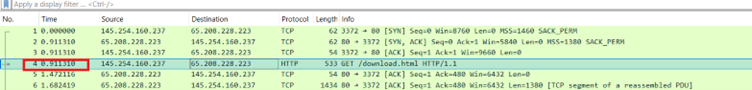

  <h1 style="text-align: center;font-weight: bold">Laporan Workshop Administrasi Jaringan </h1>
  <h2 style="text-align: center;">Tugas Review </h2>
  <h4 style="text-align: center;">Dosen Pengampu : Dr. Ferry Astika Saputra, S.T., M.Sc.</h4>

 

  
  <h3 style="text-align: center;">Disusun Oleh :</h3>
  

  <strong>Zada Devi Mariama (3123500015)</strong>
  

<h3 style="text-align: center;line-height: 1.5">Politeknik Elektronika Negeri Surabaya Departemen Teknik Informatika Dan Komputer Program Studi Teknik Informatika 2025/2026</h3>
  

 

1.	Analisa file http.cap dengan wireshark : 

    Versi HTTP yang digunakan, 

    

    IP address dari client maupun server, 

    

    Waktu dari client mengirimkan HTTP request., 

    

    Waktu dari server mengirimkan server dan berapa durasinya 

    

    

    

    Total durasi yaitu 4,86969 – 3,955688 = 0,891281

2.	Deskripsi gambar pada slide

    

    * Data link layer bertanggung jawab untuk pengiriman frame (data dalam bentuk paket) antar node yang terhubung. Pengiriman menggunakan alamat MAC untuk memilih satu node dari beberapa node.
    * Network layer bertanggung jawab untuk pengiriman datagram antara dua host (host ke host). Pengirirman menggunakan almat IP untuk memilih satu host diantara jutaan host.
    * Transport layer bertanggung jawab untuk pengiriman antara process ke process. Dalam hal ini, diperlukan nomor port untuk memilih diantara beberapa process yang berjalan pada host tujuan, sehingga data yang dikirimkan ke proses yang tepat.

3.	Rangkuman tahapan komunikasi menggunakan TCP

    a.	Three-Way Handshake :

    - SYN: Client mengirimkan paket SYN ke server meminta untuk memulai koneksi.
    - SYN-ACK:Server menerima paket SYN dari klien dan membalas dengan paket SYN-ACK. Melalui paket ACK, server mengonfirmasi permintaan client. Sedangkan melalui SYN, server memberitahu bahwa ia siap membangun koneksi.
    - ACK: Client mengirimkan paket ACK untuk mengonfirmasi bahwa ia menerima balasan dari server. Setelah itu, koneksi antara client dan server terjalin dan komunikasi data dapat dimulai.

    b.	Data Transfer

    - Setelah koneksi terbentuk, data dapat dikirimkan.
    - Menggunakan flow control untuk mengatur jumlah data yang dikirim dan error control untuk memastikan data diterima dengan benar.

    d.	Four-Way Handshake

    - FIN: Client atau server mengirimkan paket FIN untuk memulai proses pemutusan koneksi.
    - ACK: Penerima paket FIN mengirimkan paket ACK untuk mengonfirmasi penerimaan permintaan pemutusan.
    - FIN: Penerima ACK mengirimkan paket FIN tanda menutup koneksi.
    - ACK: Pihak pertama mengirimkan paket ACK sebagai konfirmasi pemutusan koneksi.

# Referensi

    - https://itexamanswers.net/cyberops-associate-module-16-attacking-the-foundation.html/
    
    - https://www.prepbytes.com/blog/computer-network/tcp-connection-establishment/#:~:text=The%20key%20steps%20in%20TCP%20connection%20establishment%20are,an%20acknowledgment%20%28ACK%29%20packet%20to%20the%20server.%20/
    
    - https://online.binus.ac.id/computer-science/2021/09/24/tcp-ip-transmission-control-protocol-internet-protocol/