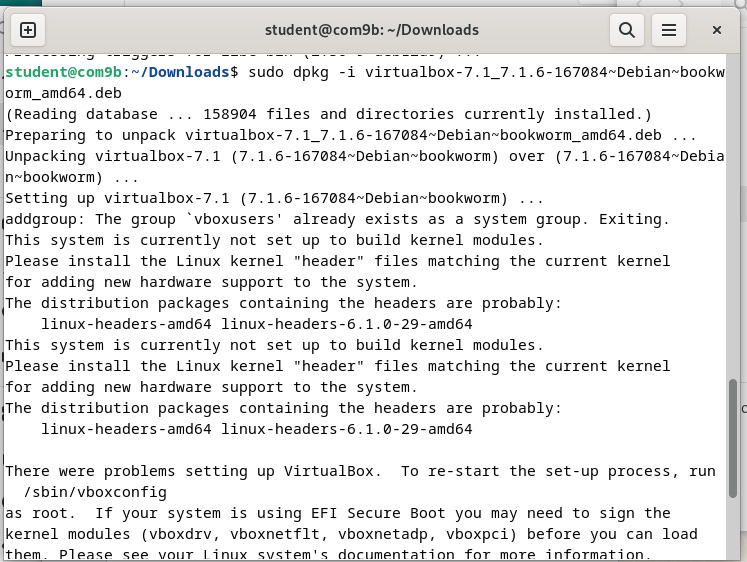
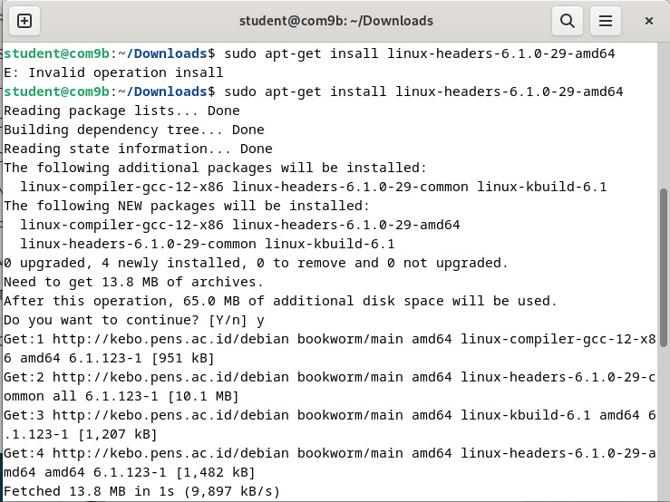

  <h1 style="text-align: center;font-weight: bold">Laporan Workshop Administrasi Jaringan </h1>
  <h2 style="text-align: center;">Instalisasi Debian  </h2>
  <h4 style="text-align: center;">Dosen Pengampu : Dr. Ferry Astika Saputra, S.T., M.Sc.</h4>

 

  
  <h3 style="text-align: center;">Disusun Oleh :</h3>
  

  <strong>Zada Devi Mariama (3123500015)</strong>
  

<h3 style="text-align: center;line-height: 1.5">Politeknik Elektronika Negeri Surabaya Departemen Teknik Informatika Dan Komputer Program Studi Teknik Informatika 2025/2026</h3>
  

 

1. Meminta alamat IP dari DHCP server
    
2. Melakukan instalisasi git dan depedensi
    
3. Melakukan git clone
    
4. Download VirtualBox untuk linux dan pilih debian 12
    
    Buka menggunakan terminal
    
5. Download ISO Debian
    
6. Melakukan intalisasi paket VirtualBox menggunakan dpkg
    
7. Masih terdapat error ketika VirtualBox dijalankan
    
8. Keterangan
    
9. Terjadi error saat akan menjalankan debian
    
    
10. Melakukan pembuatan mesin virtual di VirtualBox
    
    
    
    
    
11. Melakukan instalisasi debian
    
    
    